<div align="center">

# 🔍 Network Reconnaissance & Vulnerability Scanning with Nmap

### Mapping Attack Surfaces and Identifying Vulnerabilities Through Active Network Scanning

[](https://nmap.org/)
[](https://ubuntu.com/)
[](https://nmap.org/nsedoc/)
[](LICENSE)

<br>

*A hands-on cybersecurity project demonstrating network reconnaissance techniques — from host discovery and port scanning to OS fingerprinting, service enumeration, vulnerability detection with NSE scripts, and automated scan reporting.*

<br>

[Host Discovery](#part-1---host-discovery--network-mapping) · [Port Scanning](#part-2---port-scanning-techniques) · [Service Enumeration](#part-3---service-and-version-enumeration) · [OS Fingerprinting](#part-4---os-fingerprinting) · [NSE Vulnerability Scanning](#part-5---vulnerability-scanning-with-nse-scripts) · [Scan Automation](#part-6---automated-scanning--reporting)

</div>

---

## 📋 Project Overview

Network reconnaissance is the foundation of both penetration testing and defensive security. Before you can protect a network, you need to know what's on it — every host, every open port, every running service. This project demonstrates how to use Nmap to systematically map and assess a network environment, progressing from basic host discovery to advanced vulnerability detection.

All scanning is performed against intentionally vulnerable targets in an isolated lab environment — **never scan networks you don't own or have explicit authorization to test.**

### What This Project Covers

| Section | Skill Demonstrated | Tools Used |
|---|---|---|
| **Host Discovery** | Identifying live hosts using multiple probe techniques | `nmap -sn`, ARP, ICMP, TCP probes |
| **Port Scanning** | TCP SYN, TCP Connect, UDP, and stealth scanning | `nmap -sS`, `-sT`, `-sU`, `-sN` |
| **Service Enumeration** | Identifying services, versions, and banner grabbing | `nmap -sV`, `--version-intensity` |
| **OS Fingerprinting** | Detecting operating systems via TCP/IP stack analysis | `nmap -O`, `--osscan-guess` |
| **Vulnerability Scanning** | Detecting known CVEs and misconfigurations with NSE | `nmap --script`, `vuln` category |
| **Scan Automation** | Scripting scans with structured output and reporting | `bash`, XML/JSON output, `xsltproc` |

---

## 🏗️ Lab Environment

All scanning is performed in an isolated virtual lab. No external or unauthorized networks were scanned.

### Network Topology

```
┌──────────────────────────────────────────────────────────┐
│                VirtualBox Host-Only Network              │
│                    192.168.56.0/24                       │
│                                                          │
│      ┌────────────────┐       ┌──────────────────┐       │
│      │     Ubuntu     │       │ Metasploitable 2 │       │
│      │   (Scanner)    │       │     (Target)     │       │
│      │ 192.168.56.101 │       │  192.168.56.102  │       │
│      └───────┬────────┘       └────────┬─────────┘       │
│              │                         │                 │
│              └─────────────────────────┘                 │
│                  Host-Only Adapter                       │
└──────────────────────────────────────────────────────────┘
```

| Machine | OS | Role | IP Address |
|---|---|---|---|
| **Scanner** | Ubuntu 24.04 LTS | Nmap scanning host | 192.168.56.101 |
| **Target** | Metasploitable 2 | Intentionally vulnerable target | 192.168.56.102 |

> **Why Metasploitable 2?** It's a deliberately vulnerable Linux VM maintained for security training. It contains outdated services, weak configurations, and known vulnerabilities — providing a realistic and legal target for practicing network reconnaissance.

---

## Part 1 - Host Discovery & Network Mapping

### Understanding Host Discovery

Before scanning ports, you need to know which hosts are alive on the network. Nmap offers several discovery techniques, each with different strengths depending on the network environment.

### ARP Discovery (Local Network)

On a local network segment, ARP discovery is the most reliable method because it operates at Layer 2 and can't be blocked by host firewalls:

```bash
sudo nmap -sn -PR 192.168.56.0/24
```

> **Flag breakdown:**
> - `-sn` — ping scan only (no port scanning)
> - `-PR` — ARP ping (send ARP requests to discover hosts on the local segment)
> - `192.168.56.0/24` — scan the entire /24 subnet (256 addresses)

<div align="center">
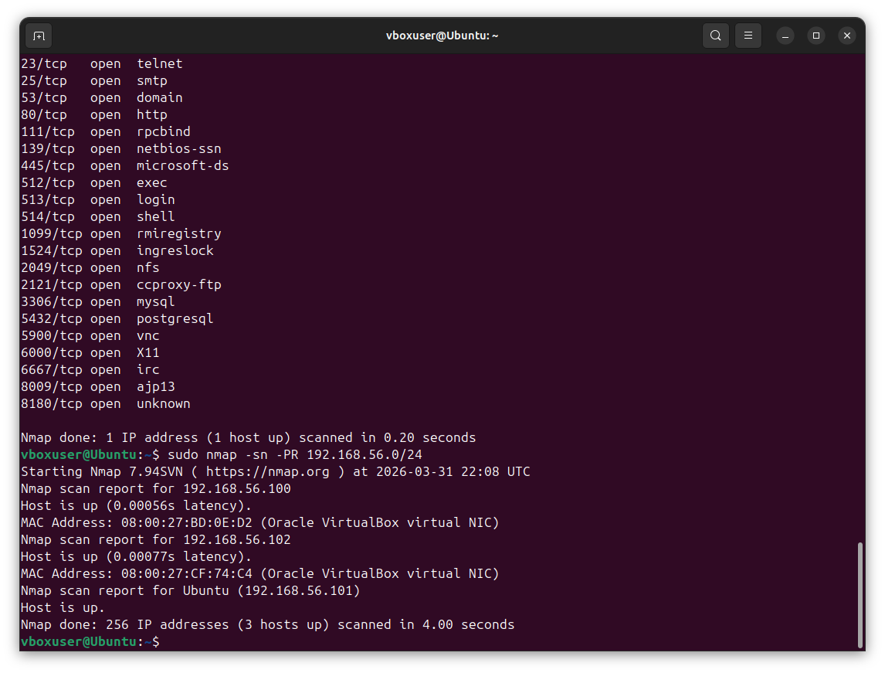
<br><em>ARP discovery identifying 3 live hosts on the local subnet — the DHCP server (192.168.56.100), the Metasploitable target (192.168.56.102), and the scanner itself (192.168.56.101)</em>
</div>

<br>

### ICMP Echo Discovery

ICMP echo requests (traditional "ping") work across routed networks but can be blocked by firewalls:

```bash
sudo nmap -sn -PE 192.168.56.0/24
```

### TCP SYN Discovery

When ICMP is blocked, TCP SYN probes to common ports can still discover hosts. This sends SYN packets to ports 80 and 443 — if the host responds with SYN/ACK or RST, it's alive:

```bash
sudo nmap -sn -PS80,443,22,8080 192.168.56.0/24
```

### Combining Discovery Techniques

For the most thorough discovery, combine multiple methods. Hosts that block ICMP might still respond to TCP or ARP:

```bash
sudo nmap -sn -PE -PS80,443,22 -PA80,443 -PP 192.168.56.0/24
```

> **Flag breakdown:**
> - `-PE` — ICMP echo request
> - `-PS80,443,22` — TCP SYN to ports 80, 443, 22
> - `-PA80,443` — TCP ACK to ports 80, 443
> - `-PP` — ICMP timestamp request (alternative ICMP method)

<div align="center">
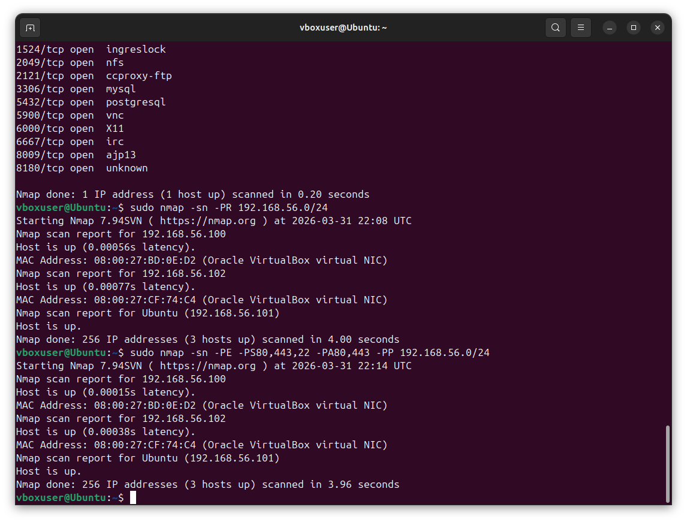
<br><em>Combined discovery using ARP, ICMP, and TCP probes — all 3 hosts confirmed with consistent results across probe types</em>
</div>

<br>

> **Why this matters for defenders:** Understanding which discovery techniques can reach your hosts helps you evaluate the effectiveness of your firewall rules. If a host responds to TCP SYN probes but blocks ICMP, an attacker can still find it.

---

## Part 2 - Port Scanning Techniques

### TCP SYN Scan (Stealth Scan)

The SYN scan is the default and most popular scan type. It sends a SYN packet and analyzes the response without completing the TCP handshake — making it faster and less likely to be logged by the target:

```bash
sudo nmap -sS -p- 192.168.56.102
```

> **Flag breakdown:**
> - `-sS` — TCP SYN scan (half-open scan)
> - `-p-` — scan all 65,535 TCP ports (not just the default top 1,000)

<div align="center">
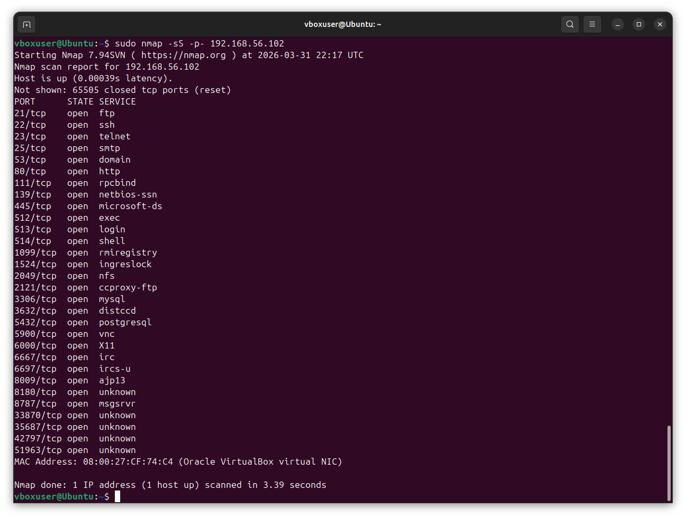
<br><em>SYN scan revealing 30 open TCP ports across the target's 65,535 port range — each open port represents a potential attack surface</em>
</div>

<br>

### TCP Connect Scan

When you don't have root privileges, the Connect scan completes the full TCP handshake. It's slower and more visible but doesn't require elevated permissions:

```bash
nmap -sT -p 1-1000 192.168.56.102
```

### UDP Scan

UDP services are often overlooked but can contain critical vulnerabilities (DNS, SNMP, DHCP). UDP scanning is slower because there's no handshake — Nmap must wait for responses or timeouts:

```bash
sudo nmap -sU --top-ports 100 192.168.56.102
```

<div align="center">
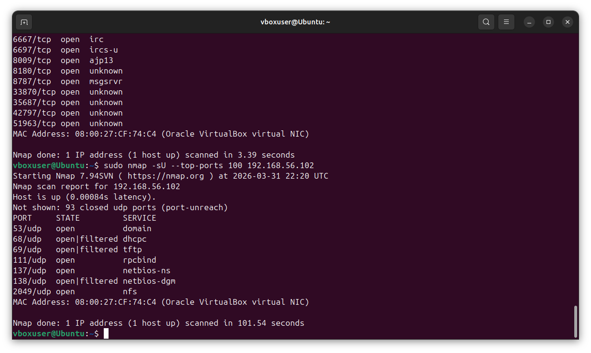
<br><em>UDP scan results showing 4 confirmed open ports (DNS, rpcbind, NetBIOS, NFS) and 3 open|filtered states — the scan took 101 seconds due to UDP's inherent timeout-based detection</em>
</div>

<br>

> **Why this matters:** Many penetration testers skip UDP scanning because it's slow. But services like SNMP (port 161) with default community strings, or DNS (port 53) vulnerable to zone transfers, are some of the easiest wins in real-world assessments.

### Comparing Scan Techniques

| Scan Type | Command | Speed | Stealth | Root Required | Use Case |
|---|---|---|---|---|---|
| **SYN Scan** | `-sS` | Fast | High | Yes | Default for most assessments |
| **Connect Scan** | `-sT` | Medium | Low | No | When root is unavailable |
| **UDP Scan** | `-sU` | Slow | Medium | Yes | Finding UDP services |
| **NULL Scan** | `-sN` | Medium | High | Yes | Firewall evasion testing |
| **FIN Scan** | `-sF` | Medium | High | Yes | Firewall evasion testing |
| **Xmas Scan** | `-sX` | Medium | High | Yes | Firewall evasion testing |

---

## Part 3 - Service and Version Enumeration

### Why Version Detection Matters

Knowing that port 80 is open tells you there's a web server — but knowing it's **Apache 2.2.8** tells you it's running a version with known CVEs. Version detection transforms a port list into actionable intelligence.

### Basic Service Detection

```bash
sudo nmap -sV 192.168.56.102
```

<div align="center">
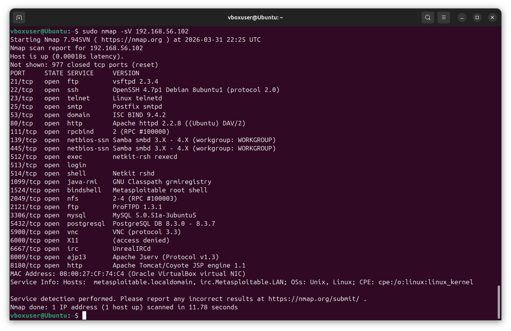
<br><em>Service detection revealing specific software versions — outdated versions like vsftpd 2.3.4 and Apache 2.2.8 immediately flag critical vulnerabilities</em>
</div>

<br>

### Aggressive Version Detection

Increasing the version detection intensity sends more probes, which can identify services that disguise themselves or run on non-standard ports:

```bash
sudo nmap -sV --version-intensity 9 -p 21,22,23,25,80,139,445,3306,5432,8180 192.168.56.102
```

> **Flag breakdown:**
> - `-sV` — enable version detection
> - `--version-intensity 9` — maximum probe intensity (range: 0–9)
> - `-p 21,22,...` — target specific ports of interest

### Banner Grabbing

Some services reveal detailed information in their connection banners. Nmap's version detection captures these automatically, but you can also see them in the scan output:

```bash
sudo nmap -sV --script=banner -p 21,22,23,25,80 192.168.56.102
```

<div align="center">
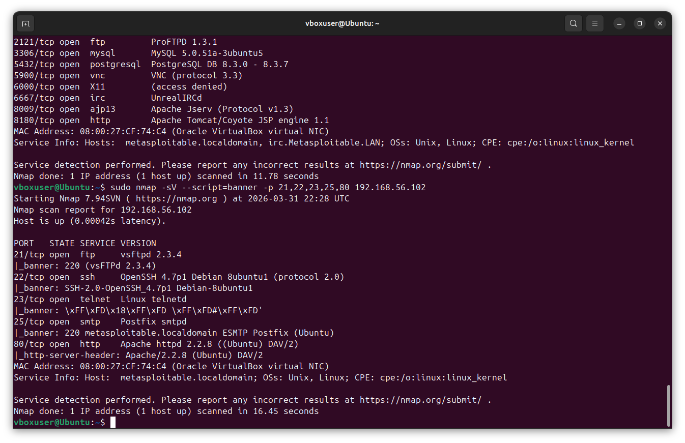
<br><em>Banner grabbing revealing FTP (vsFTPd 2.3.4), SSH (OpenSSH_4.7p1), SMTP (Postfix), and Apache server headers — each banner leaks version information useful for vulnerability research</em>
</div>

<br>

### Service Detection Findings

| Port | Service | Version | Risk Assessment |
|---|---|---|---|
| 21/tcp | FTP | vsftpd 2.3.4 | 🔴 Critical — known backdoor vulnerability (CVE-2011-2523) |
| 22/tcp | SSH | OpenSSH 4.7p1 Debian 8ubuntu1 | 🟡 Medium — outdated, multiple known vulnerabilities |
| 23/tcp | Telnet | Linux telnetd | 🔴 Critical — plaintext protocol, no encryption |
| 25/tcp | SMTP | Postfix smtpd | 🟡 Medium — potential for open relay misconfiguration |
| 53/tcp | DNS | ISC BIND 9.4.2 | 🟡 Medium — outdated, check for zone transfer |
| 80/tcp | HTTP | Apache httpd 2.2.8 (Ubuntu) DAV/2 | 🔴 Critical — severely outdated, many known CVEs |
| 139/445 | SMB | Samba smbd 3.X - 4.X | 🔴 Critical — vulnerable to enumeration and RCE |
| 1524/tcp | Bindshell | Metasploitable root shell | 🔴 Critical — open root backdoor |
| 2121/tcp | FTP | ProFTPD 1.3.1 | 🟡 Medium — outdated FTP server |
| 3306/tcp | MySQL | MySQL 5.0.51a-3ubuntu5 | 🟡 Medium — outdated, check for auth bypass |
| 5432/tcp | PostgreSQL | PostgreSQL DB 8.3.0 - 8.3.7 | 🟡 Medium — check for default/weak credentials |
| 5900/tcp | VNC | VNC protocol 3.3 | 🟡 Medium — check for weak/no authentication |
| 6667/tcp | IRC | UnrealIRCd | 🔴 Critical — known backdoor in certain versions |
| 8180/tcp | HTTP | Apache Tomcat/Coyote JSP engine 1.1 | 🟡 Medium — check for manager console exposure |

---

## Part 4 - OS Fingerprinting

### How OS Detection Works

Nmap identifies operating systems by analyzing subtle differences in how they implement the TCP/IP stack. Different OS versions respond differently to specially crafted packets — things like TCP window sizes, TTL values, and flag handling create a unique fingerprint.

### Running OS Detection

```bash
sudo nmap -O --osscan-guess 192.168.56.102
```

> **Flag breakdown:**
> - `-O` — enable OS detection
> - `--osscan-guess` — make Nmap guess more aggressively if no perfect match is found

<div align="center">
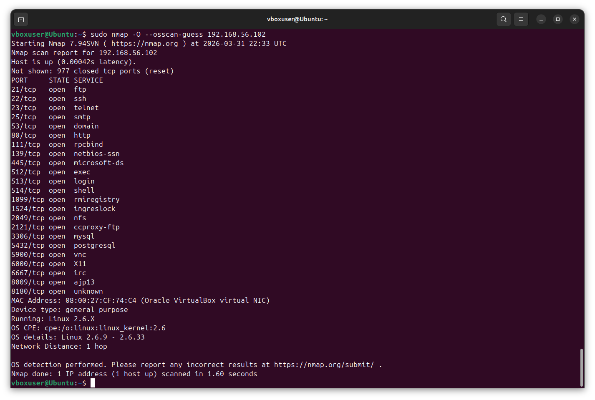
<br><em>OS detection identifying the target as Linux 2.6.9 - 2.6.33 — a kernel version with known privilege escalation vulnerabilities</em>
</div>

<br>

### Comprehensive Scan (OS + Services + Scripts)

Combining OS detection with service enumeration and default scripts gives the most complete picture:

```bash
sudo nmap -A 192.168.56.102
```

The `-A` flag enables: OS detection (`-O`), version detection (`-sV`), script scanning (`-sC`), and traceroute (`--traceroute`).

<div align="center">
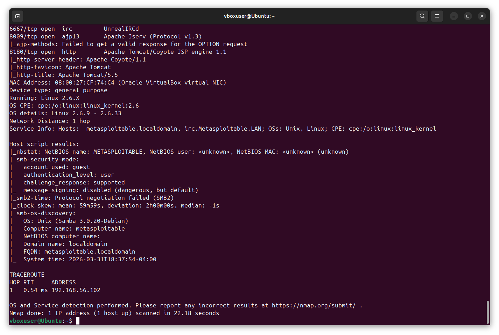
<br><em>Aggressive scan revealing OS details (Linux 2.6.X), SMB security mode (guest account, message signing disabled), Samba version (3.0.20-Debian), and a single-hop traceroute confirming direct network adjacency</em>
</div>

<br>

> **Why this matters:** OS fingerprinting is critical for vulnerability assessment. The Linux 2.6.x kernel identified on this target has known privilege escalation vulnerabilities. Combined with the Samba 3.0.20 version from the SMB discovery script, this information directly drives exploit selection in penetration testing and patch prioritization in defensive security.

---

## Part 5 - Vulnerability Scanning with NSE Scripts

### What Is the Nmap Scripting Engine (NSE)?

NSE extends Nmap beyond port scanning into vulnerability detection, brute-force testing, and advanced reconnaissance. Scripts are organized into categories like `vuln`, `auth`, `discovery`, `exploit`, and `safe`.

### Running Default Scripts

The default script set (`-sC`) runs safe, commonly useful scripts:

```bash
sudo nmap -sC -sV -p 21,22,80,139,445 192.168.56.102
```

### Vulnerability-Specific Scanning

Run all vulnerability detection scripts against the target:

```bash
sudo nmap --script vuln -p 21,22,80,139,445,3306 192.168.56.102
```

<div align="center">
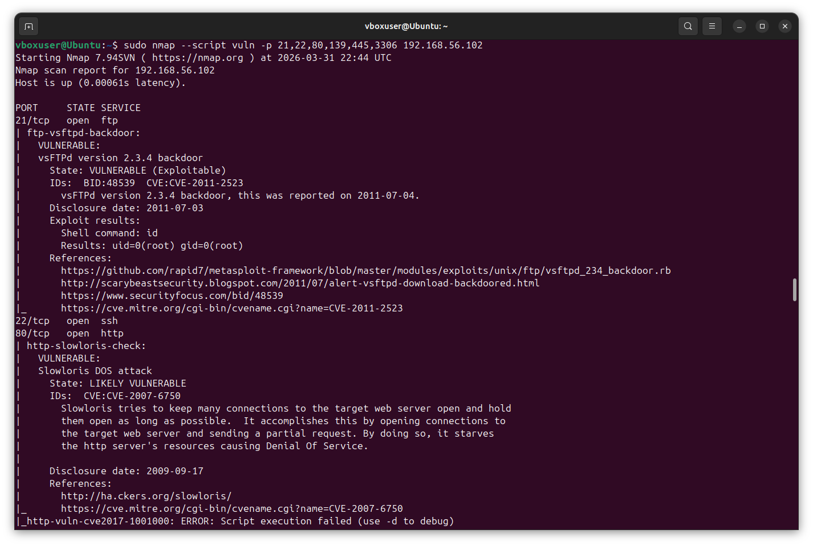
<br><em>NSE vulnerability scripts confirming the vsftpd 2.3.4 backdoor (CVE-2011-2523) as exploitable with root access, and Apache as likely vulnerable to Slowloris DoS (CVE-2007-6750)</em>
</div>

<br>

### Targeted Script Examples

**FTP Anonymous Login Check:**

```bash
sudo nmap --script ftp-anon -p 21 192.168.56.102
```

**SMB Enumeration (Users, Shares, OS Discovery, Security Mode):**

```bash
sudo nmap --script smb-os-discovery,smb-enum-shares,smb-enum-users,smb-security-mode -p 139,445 192.168.56.102
```

<div align="center">
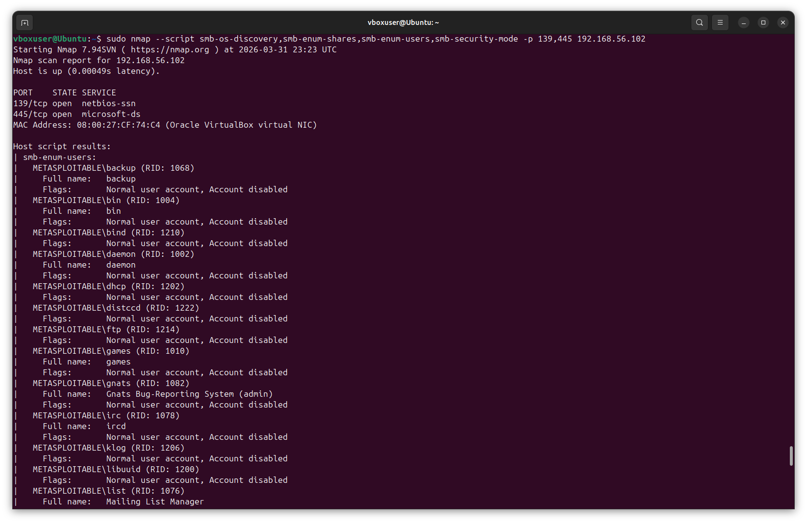
<br><em>SMB enumeration scripts extracting the complete user account list without authentication — an attacker can use this for password spraying or brute-force attacks against exposed services</em>
</div>

<br>

**HTTP Enumeration:**

```bash
sudo nmap --script http-enum -p 80 192.168.56.102
```

**SSL/TLS Analysis:**

```bash
sudo nmap --script ssl-enum-ciphers,ssl-cert -p 443 192.168.56.102
```

### NSE Vulnerability Findings

| Script | Target Port | Finding | Severity |
|---|---|---|---|
| `ftp-vsftpd-backdoor` | 21 | vsftpd 2.3.4 backdoor — exploitable with root shell access (CVE-2011-2523) | 🔴 Critical |
| `ftp-anon` | 21 | Anonymous FTP login allowed (FTP code 230) | 🟡 Medium |
| `http-slowloris-check` | 80 | Apache likely vulnerable to Slowloris DoS attack (CVE-2007-6750) | 🟡 Medium |
| `http-enum` | 80 | Exposed directories: /tikiwiki/, /phpMyAdmin/, /phpinfo.php, /test/, /doc/ | 🟡 Medium |
| `smb-enum-users` | 139/445 | Anonymous user enumeration — full account list exposed without credentials | 🟡 Medium |
| `smb-enum-shares` | 139/445 | Writable share `/tmp` with anonymous READ/WRITE access | 🔴 Critical |
| `ssh-auth-methods` | 22 | Password authentication enabled (publickey + password) | 🟢 Low |

> **Why this matters:** NSE scripts automate what would otherwise require dozens of specialized tools. A single Nmap command can check for known backdoors, default credentials, directory listings, and CVEs — skills that are essential for both penetration testers and security engineers running vulnerability assessments.

---

## Part 6 - Automated Scanning & Reporting

### Why Automate?

Manual scanning works for single targets, but real-world assessments involve entire subnets. Automated scripts ensure consistent, repeatable scans with structured output for reporting.

### Structured Output Formats

Nmap supports multiple output formats. For automation, XML output is the most useful:

```bash
sudo nmap -sV -sC -O -oX scan_results.xml -oN scan_results.txt 192.168.56.102
```

> **Flag breakdown:**
> - `-oX scan_results.xml` — save results in XML format (machine-parseable)
> - `-oN scan_results.txt` — save results in normal text format (human-readable)

### Converting XML to HTML Report

Nmap includes an XSL stylesheet that converts XML output into a professional HTML report:

```bash
xsltproc scan_results.xml -o scan_report.html
```

<div align="center">
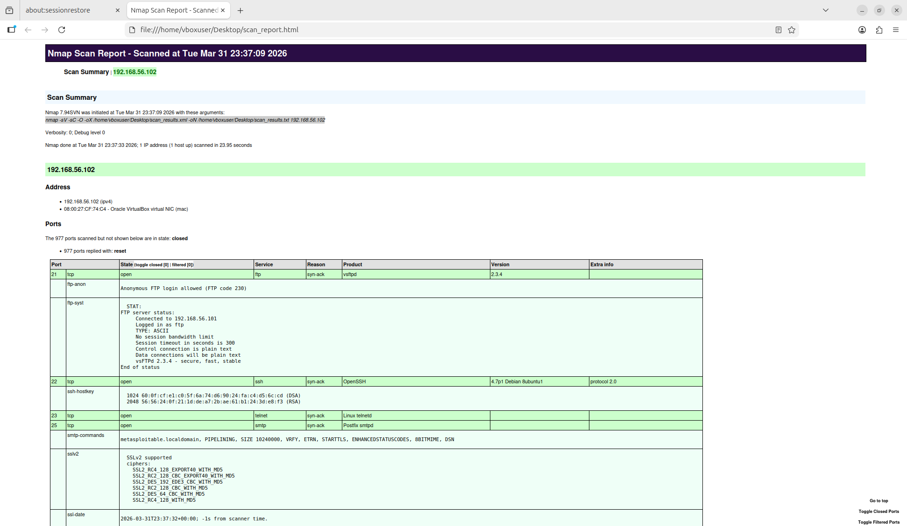
<br><em>Professional HTML report showing scan summary, host details, and a formatted port table with service versions and NSE script output — suitable for including in assessment deliverables</em>
</div>

<br>

### Automated Network Scan Script

This script performs a complete assessment workflow: discovery, port scanning, service detection, and vulnerability checking, with structured output:

```bash
#!/bin/bash
# network_scan.sh - Automated network assessment workflow
#
# Usage: sudo ./network_scan.sh <target_subnet> [output_dir]
# Example: sudo ./network_scan.sh 192.168.56.0/24 ./scan_results

TARGET="${1:?Usage: sudo $0 <target_or_subnet> [output_dir]}"
OUTPUT_DIR="${2:-./scan_results}"
TIMESTAMP=$(date +%Y%m%d_%H%M%S)

mkdir -p "$OUTPUT_DIR"

echo "========================================"
echo "  Automated Network Assessment"
echo "========================================"
echo "Target:    $TARGET"
echo "Output:    $OUTPUT_DIR"
echo "Timestamp: $TIMESTAMP"
echo ""

# Phase 1: Host Discovery
echo "[Phase 1] Host Discovery..."
sudo nmap -sn -PE -PS80,443,22 "$TARGET" \
  -oN "$OUTPUT_DIR/${TIMESTAMP}_discovery.txt" \
  -oX "$OUTPUT_DIR/${TIMESTAMP}_discovery.xml"

LIVE_HOSTS=$(grep "Host is up" "$OUTPUT_DIR/${TIMESTAMP}_discovery.txt" | wc -l)
echo "  Found $LIVE_HOSTS live hosts."
echo ""

# Phase 2: Port Scanning
echo "[Phase 2] Port Scanning (top 1000 ports)..."
sudo nmap -sS --top-ports 1000 "$TARGET" \
  -oN "$OUTPUT_DIR/${TIMESTAMP}_ports.txt" \
  -oX "$OUTPUT_DIR/${TIMESTAMP}_ports.xml"

echo "  Port scan complete."
echo ""

# Phase 3: Service Detection
echo "[Phase 3] Service & Version Detection..."
sudo nmap -sV --version-intensity 5 -sC "$TARGET" \
  -oN "$OUTPUT_DIR/${TIMESTAMP}_services.txt" \
  -oX "$OUTPUT_DIR/${TIMESTAMP}_services.xml"

echo "  Service detection complete."
echo ""

# Phase 4: Vulnerability Scan
echo "[Phase 4] NSE Vulnerability Scanning..."
sudo nmap --script vuln "$TARGET" \
  -oN "$OUTPUT_DIR/${TIMESTAMP}_vulns.txt" \
  -oX "$OUTPUT_DIR/${TIMESTAMP}_vulns.xml"

echo "  Vulnerability scan complete."
echo ""

# Generate HTML Reports
echo "[Report] Generating HTML reports..."
for xml_file in "$OUTPUT_DIR"/${TIMESTAMP}_*.xml; do
    html_file="${xml_file%.xml}.html"
    xsltproc "$xml_file" -o "$html_file" 2>/dev/null
done

echo ""
echo "========================================"
echo "  Assessment Complete"
echo "========================================"
echo "Results saved to: $OUTPUT_DIR/"
echo ""
ls -lh "$OUTPUT_DIR"/${TIMESTAMP}_*
```

### Quick Scan Script for Specific Hosts

A lightweight script for rapid assessment of individual hosts:

```bash
#!/bin/bash
# quick_scan.sh - Fast targeted scan of a single host
#
# Usage: sudo ./quick_scan.sh <target_ip>
# Example: sudo ./quick_scan.sh 192.168.56.102

TARGET="${1:?Usage: sudo $0 <target_ip>}"

echo "========================================"
echo "  Quick Scan: $TARGET"
echo "========================================"
echo ""

echo "[1/4] Top 100 ports (SYN scan)..."
sudo nmap -sS --top-ports 100 -T4 "$TARGET" --open
echo ""

echo "[2/4] Service versions on open ports..."
OPEN_PORTS=$(sudo nmap -sS --top-ports 100 -T4 "$TARGET" --open \
  -oG - | grep "Ports:" | grep -oP '\d+/open' | cut -d'/' -f1 | \
  tr '\n' ',' | sed 's/,$//')

if [ -n "$OPEN_PORTS" ]; then
    sudo nmap -sV -p "$OPEN_PORTS" "$TARGET"
    echo ""

    echo "[3/4] OS detection..."
    sudo nmap -O --osscan-guess "$TARGET"
    echo ""

    echo "[4/4] Quick vulnerability check..."
    sudo nmap --script vuln -p "$OPEN_PORTS" "$TARGET"
else
    echo "  No open ports found."
fi

echo ""
echo "========================================"
echo "  Quick Scan Complete"
echo "========================================"
```

---

## 🔑 Key Nmap Commands Reference

A quick reference of all scan techniques used throughout this project:

| Command | Purpose |
|---|---|
| `nmap -sn -PR <subnet>` | ARP host discovery (local network) |
| `nmap -sn -PE -PS80,443 <subnet>` | Combined ICMP + TCP host discovery |
| `nmap -sS -p- <target>` | Full TCP SYN scan (all 65,535 ports) |
| `nmap -sT -p 1-1000 <target>` | TCP Connect scan (no root required) |
| `nmap -sU --top-ports 100 <target>` | UDP scan (top 100 ports) |
| `nmap -sV <target>` | Service version detection |
| `nmap -sV --version-intensity 9 <target>` | Aggressive version detection |
| `nmap -O --osscan-guess <target>` | OS fingerprinting |
| `nmap -A <target>` | Aggressive scan (OS + versions + scripts + traceroute) |
| `nmap -sC -sV <target>` | Default scripts + version detection |
| `nmap --script vuln <target>` | Vulnerability detection scripts |
| `nmap --script smb-enum-users,smb-enum-shares -p 445 <target>` | SMB enumeration |
| `nmap -oX results.xml <target>` | Save output as XML for reporting |

---

## 🧰 Tools & Environment

| Component | Version | Purpose |
|---|---|---|
| **Ubuntu** | 24.04 LTS | Scanning host (VirtualBox VM) |
| **Nmap** | 7.94SVN | Network scanning and vulnerability assessment |
| **NSE** | Built-in | Nmap Scripting Engine for advanced detection |
| **Metasploitable 2** | 2.0.0 | Intentionally vulnerable target VM |
| **VirtualBox** | Latest | VM hypervisor with host-only networking |

---

## 📚 Summary

This project demonstrates practical network reconnaissance and vulnerability assessment skills through six progressive exercises:

1. **Host Discovery** — Used multiple probe techniques (ARP, ICMP, TCP) to identify 3 live hosts on the lab network, understanding the strengths and limitations of each method
2. **Port Scanning** — Performed TCP SYN and UDP scans to map the target's attack surface, discovering 30 open TCP ports and 7 open/filtered UDP ports across 65,535 ports
3. **Service Enumeration** — Identified specific software versions running on each open port, flagging critical outdated services including vsftpd 2.3.4, Apache 2.2.8, and Samba 3.0.20
4. **OS Fingerprinting** — Determined the target is running Linux kernel 2.6.9 - 2.6.33 through TCP/IP stack analysis, enabling targeted vulnerability research
5. **Vulnerability Scanning** — Leveraged NSE scripts to confirm the vsftpd 2.3.4 backdoor (CVE-2011-2523), anonymous FTP access, writable SMB shares, exposed web directories, and unauthenticated user enumeration
6. **Scan Automation** — Built scripts for repeatable assessments with structured XML/HTML output suitable for professional reporting

### Skills Demonstrated

`Network Reconnaissance` · `Port Scanning` · `Service Enumeration` · `OS Fingerprinting` · `Vulnerability Assessment` · `NSE Scripting` · `Linux Administration` · `Bash Scripting` · `Security Reporting` · `Attack Surface Mapping`

---

<div align="center">

### 🔗 Related Projects

[](https://github.com/jesse12-21/wireshark-threat-detection)
[](https://github.com/)
[](https://github.com/)

<br>

*Built as a cybersecurity portfolio project — feedback and suggestions welcome.*

</div>
